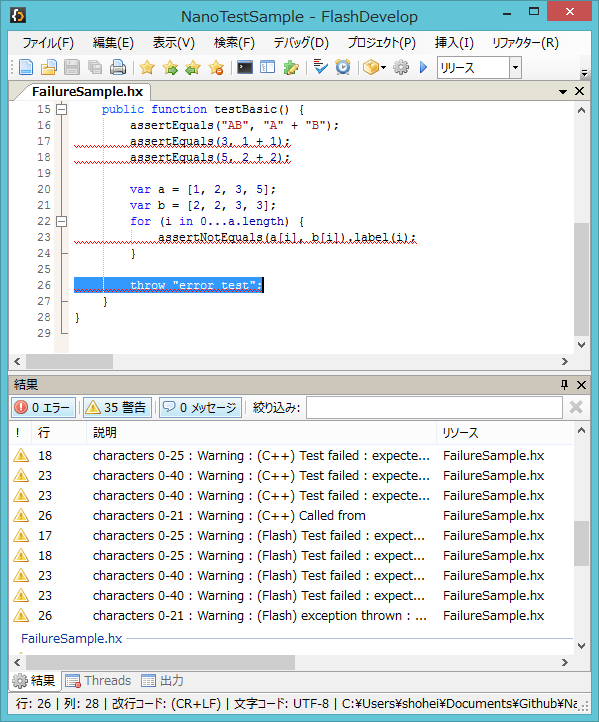
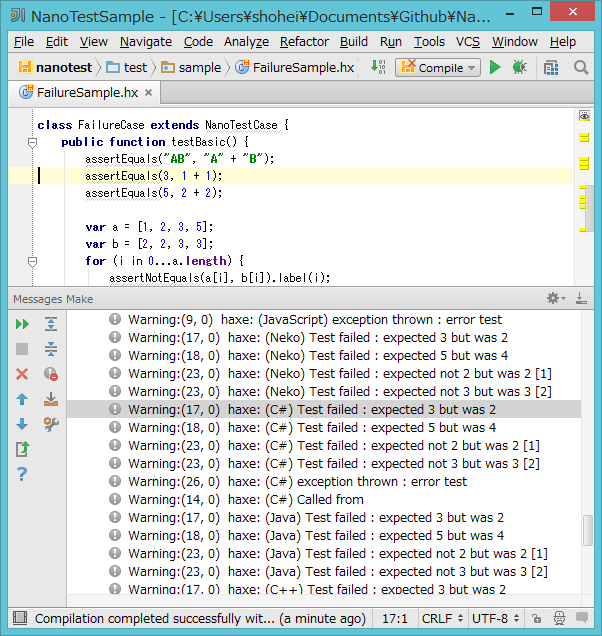

NanoTest is a light weight test library. Its interface is similar to the [haxe.unit](http://haxe.org/doc/cross/unit) testing framework, but it can run as pre-compilation macro and can output test failures as compiler warnings or errors.

#NanoTest with FlashDevelop


#NanoTest with Intellij IDEA


NanoTest can display test failures as compiler warnings on the Result Panel of [FlashDevelop](http://www.flashdevelop.org/) and other IDEs.

#Installing NanoTest

You can install NanoTest from haxelib.

```
haxelib install nanotest
```

#Running test as macro

Create test classes and save them as sample/TestSample.hx.

```hx
package sample;
import nanotest.NanoTestRunner;
import nanotest.NanoTestCase;

class TestSample {
    static function main(){
        var r = new NanoTestRunner();
        r.add(new SampleCase());
        r.run();
    }
}

class SampleCase extends NanoTestCase {
    public function testBasic(){
        assertEquals( "A", "A" );
    }
}
```

Create compile.hxml with the content:

```
--next
-neko report/test.n
-main sample.FailureSample
-lib nanotest
-cp sample
-debug

--next
-cmd neko "report/test.n" 1>report/neko.txt

--next
-lib nanotest
--macro nanotest.NanoTestRunner.readResult('report/neko.txt', ['sample'], 'Neko')
```

Compile it on commandline

```
haxe compile.hxml
```

#Output test failures as compilation errors

Use NanoTestRunner.error as failure output function.
```hx
var r = new NanoTestRunner(NanoTestRunner.error);
```

#Improvements from haxe.unit

NanoTestCase has some addtional functions,

<dl>
<dt>assertThrows(func:Void->Void, ?isSuccess:Dynamic->Bool, ?p:PosInfos)</dt>
<dd>assert a function expected to throw exception. If isSuccess function is set, the thrown exception is tested by the isSuccess function.</dd>
<dt>assertNotEquals(expected:T, ?actual:T, ?p:PosInfos)</dt>
<dd>assert values which do not equals</dd>
<dt>globalSetup()</dt>
<dd>setup which is run once per class of tests</dd>
<dt>globalTearDown()</dt>
<dd>tearDown which is run once per class of tests</dd>
<dt>success(?posInfos:PosInfos)</dt>
<dd>output a success</dd>
<dt>fail(message:String, ?posInfos:PosInfos)</dt>
<dd>output a failure</dd>
<dt>error(e:Dynamic)</dt>
<dd>output the current exception</dd>
<dl>

and the **assertEquals** function supports EnumValue.

## Use label

The label function can be used for subtending failures in same line.


```hx
class SampleCase extends NanoTestCase {
    public function testBasic() {
        var a = [1, 2, 3, 5];
        var b = [2, 2, 3, 3];
        for (i in 0...a.length) {
            assertEquals(a[i], b[i]).label(i);
        }
    }
}
```

This result is below.

```
Test failed : expected 1 but was 2 [0]
Test failed : expected 5 but was 3 [3]
```

#License

The MIT License
